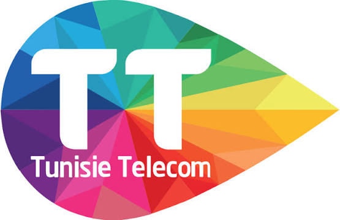
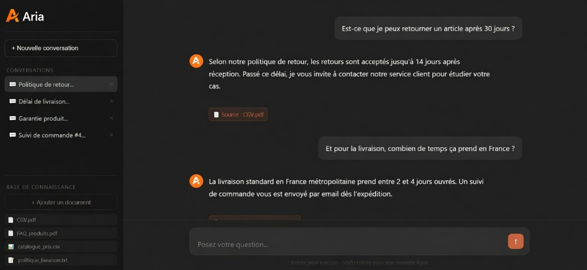

<p align="center">
  
</p>

<p align="center">
  <em>Tunisie Telecom is Tunisia’s national operator, delivering mobile, fixed-line, and internet services nationwide.</em>
</p>

<h1 align="center">Telecom AI Agent</h1>

<p align="center">
  <strong>Generative AI assistant for Drive Test analysis on LTE 4G and UMTS 3G networks</strong>
</p>

<p align="center">
  <a href="https://github.com/hadil51/Telecom-AI-Agent"></a>
  
  
  
  
</p>

<p align="center">
  
</p>

---

## Overview

**Telecom AI Agent** is an end-to-end application that turns raw Drive Test campaigns into operator-ready insight. Engineers upload LTE or UMTS logs, ask questions in natural language, and receive KPI classifications, charts, and optimization recommendations grounded in the measurements.

The project was developed as an engineering project in the context of **Tunisie Telecom** radio quality analysis.

**Repository:** [https://github.com/hadil51/Telecom-AI-Agent.git](https://github.com/hadil51/Telecom-AI-Agent.git)

---

## Features

| Capability | Description |
|---|---|
| Conversational analysis | Ask questions in French about coverage, quality, and throughput |
| KPI classification | Automatic mapping of RSRP, RSRQ, Throughput, RSCP, and Ec/N0 to standard quality bands |
| In-chat visualizations | Pie, bar, and line charts rendered from live dataset statistics |
| Full campaign report | Global assessment plus concrete radio optimization recommendations |
| File ingest | Upload new Drive Test files (XLSX / CSV) |
| Multi-dataset | Switch and compare 3G vs 4G campaigns in the same session |

---

## Architecture

```
telecom-agent/
├── backend/                     FastAPI service
│   ├── main.py                  REST API
│   ├── data_processor.py        Parsing and KPI classification
│   ├── ai_agent.py              Groq LLM agent (Llama 3.3 70B)
│   ├── models.py                Pydantic schemas
│   └── requirements.txt
├── frontend/                    React 18 UI
│   └── src/components/
│       ├── TelecomAgent.js
│       ├── Sidebar.js
│       ├── ChatArea.js
│       ├── MessageBubble.js
│       ├── UploadModal.js
│       └── ReportModal.js
├── data/                        Sample Drive Test campaigns
│   ├── DT1.xlsx                 LTE 4G (RSRP, RSRQ, Throughput)
│   ├── DT2.csv                  UMTS 3G (RSCP, Ec/N0)
│   └── DT3.csv                  UMTS 3G (RSCP, Ec/N0)
├── docs/                        README assets
├── start_backend.sh
└── start_frontend.sh
```

**Request flow:** React UI → FastAPI (`/api/chat`, `/api/report`, …) → `DataProcessor` (pandas) + Groq LLM → JSON response with optional chart/report payloads.

---

## Tech stack

| Layer | Stack |
|---|---|
| Backend | FastAPI, Uvicorn, Pydantic |
| Data | pandas, NumPy, openpyxl |
| AI | Groq API (`llama-3.3-70b-versatile`) via OpenAI-compatible client |
| Frontend | React 18, Axios, Recharts, Lucide, react-markdown |

---

## KPI reference

### LTE 4G

| KPI | Very good | Good | Average | Poor |
|---|---|---|---|---|
| RSRP (dBm) | ≥ −80 | −90 to −80 | −100 to −90 | −130 to −100 |
| RSRQ (dB) | ≥ −5 | −10 to −5 | −14 to −10 | ≤ −14 |
| Throughput DL | ≥ 30 Mbps | 25–30 | 20–25 | < 10 |

### UMTS 3G

| KPI | Very good | Good | Average | Poor |
|---|---|---|---|---|
| RSCP (dBm) | ≥ −75 | −85 to −75 | −95 to −85 | < −95 |
| Ec/N0 (dB) | ≥ −6 | −10 to −6 | −15 to −10 | < −15 |

---

## Quick start

### Prerequisites

- Python **3.10+**
- Node.js **18+**
- A [Groq](https://console.groq.com) API key (`GROQ_API_KEY`)

### 1. Clone

```bash
git clone https://github.com/hadil51/Telecom-AI-Agent.git
cd Telecom-AI-Agent
```

### 2. Backend

```bash
export GROQ_API_KEY="your-key-here"   # Windows PowerShell: $env:GROQ_API_KEY="your-key-here"
cd backend
pip install -r requirements.txt
uvicorn main:app --reload --port 8000
```

Alternatively: `./start_backend.sh` (set `GROQ_API_KEY` in the environment first).

- API: http://localhost:8000  
- OpenAPI docs: http://localhost:8000/docs  

### 3. Frontend

```bash
cd frontend
npm install
npm start
```

Alternatively: `./start_frontend.sh`

- UI: http://localhost:3000  

---

## API

| Method | Endpoint | Description |
|---|---|---|
| `GET` | `/api/datasets` | Loaded datasets and summary stats |
| `GET` | `/api/dataset/{name}/stats` | Detailed statistics |
| `GET` | `/api/dataset/{name}/kpi-distribution` | KPI quality distribution (charts) |
| `GET` | `/api/dataset/{name}/timeseries` | Time series for a KPI |
| `POST` | `/api/upload` | Upload a new campaign file |
| `POST` | `/api/chat` | Conversational analysis |
| `POST` | `/api/report` | Full campaign report |

---

## Drive Test file formats

**LTE (XLSX)** — required columns:

`Time`, `Physical cell identity (pcell)`, `Band (pcell)`, `RSRP (pcell)`, `RSRQ (pcell)`, `RLC downlink throughput`

**UMTS (CSV, semicolon-separated)** — required columns:

`Time`, `Band (active)`, `Channel number (active)`, `Scrambling code (active)`, `RSCP (active)`, `Ec/N0 (active)`

---

## Security note

Do not commit API keys. Export `GROQ_API_KEY` locally or use a `.env` file that remains gitignored.

---
